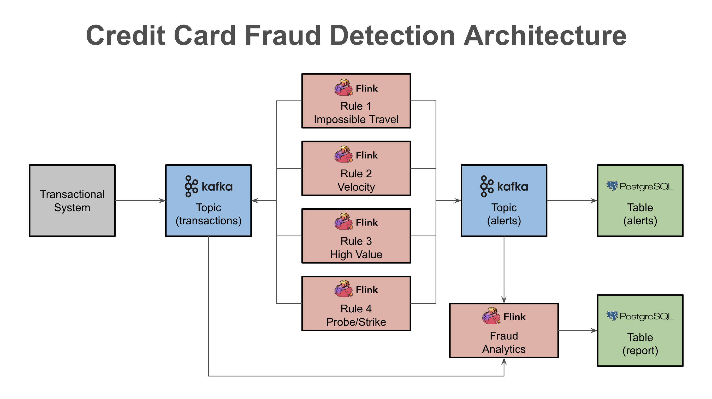

# Fraud Detection use case with Flink SQL




# Manual Setup

## Infrastructure
Spin up a ec2-instance with the following setup:

region: eu-central-1  
type: c6a.4xlarge  
aim: ami-07801e143d22c782d  

## Setup  
Connect to the ec2-instance via ssh and execute the commands:   
```
sudo su   
cd /root 

yum update -y  
yum install -y git  
 
git clone https://github.com/campossalex/ververica-fraud-prevention ververica-platform-playground  
./ververica-platform-playground/manual_setup.sh
```

# Terraform Setup

Run the steps describe here: https://github.com/campossalex/ververica-fraud-prevention/tree/master/terraform
